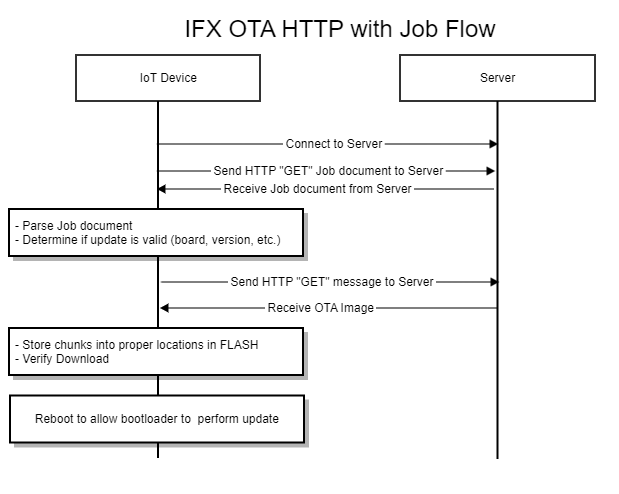

[Click here](../README.md) to view the README.

## Design and implementation

The over-the-air (OTA) update feature allows devices (mobile phones, vehicle, other IoT devices) to download and update their software using a wireless network connection. OTA updates allow you to deploy firmware updates to one or more devices in your fleet. 

Jobs are used to accomplish OTA updates in a repeatable, reliable, controlled, and auditable way. A job document (JSON document) is a description of the remote operations to be performed by the devices.

The OTA library utilizes HTTPS/HTTP to connect to an HTTPS/HTTP server to download and update the user application. 

**Wi-Fi update flows**

Job flow: The device downloads a job document that provides information about the update.

> **Note:** Use Makefile defines OTA_HTTPS_SUPPORT to use the HTTPS protocol support from the OTA library.

Application image can be stored in two slots on the device 
- **Primary slot (BOOT):** Stores the currently executing application
- **Secondary slot (UPDATE):** Stores the new application that is being downloaded

Upon reset, the Edge Protect Bootloader (running on the device) performs an OTA update by overwriting the update image from Secondary Slot (slot 1) to Primary Slot (slot 0).

**Figure 1. OTA HTTP update flow**

**Table 1. Application projects**

Project | Description
--------|------------------------
proj_cm33_s | Project for CM33 secure processing environment (SPE)
proj_cm33_ns | Project for CM33 non-secure processing environment (NSPE)
proj_cm55 | CM55 project

 

In this code example, at device reset, the secure boot process starts from the ROM boot with the secure enclave (SE) as the root of trust (RoT). From the secure enclave, the boot flow is passed on to the system CPU subsystem where the Edge Protect Bootloader is the first application to be started. The Edge Protect Bootloader then verifies and launches the secure CM33 application. After all necessary secure configurations, the flow is passed on to the non-secure CM33 application. Resource initialization for this example is performed by this CM33 non-secure project. It initializes the OTA and HTTPS/HTTP configurations and starts the OTA firmware update task. It then enables the CM55 core using the `Cy_SysEnableCM55()` function.

 